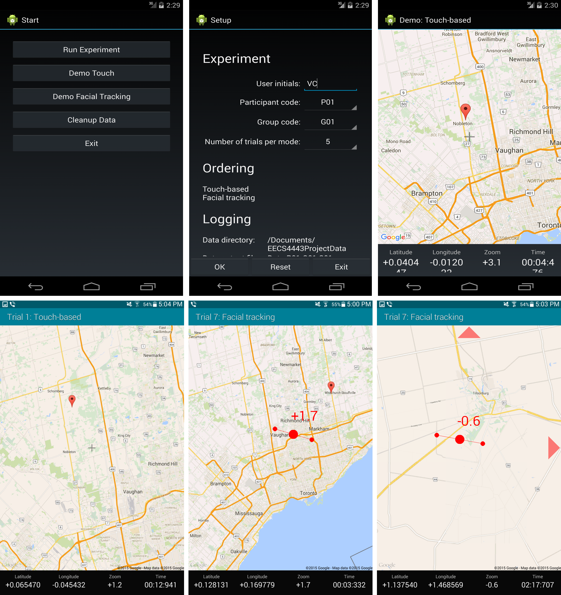

# EECS 4443: Mobile User Interface
## A Comparison of Input Methods for Panning and Zooming - Touch-based and Facial Tracking

* [EECS 4443](http://www.eecs.yorku.ca/course_archive/2014-15/W/4443/)
* [Project (original)](http://www.eecs.yorku.ca/course_archive/2014-15/W/4443/project.html)
* [Project Description](docs/requirements.md)
* [York University](http://www.eecs.yorku.ca)

Implemented an Android application for performing a user study comparing the
accuracy and speed of facial-tracking and touch-based input methods. The
software was developed in Java using the Google Android SDK, Google Maps API and
Qualcomm Snapdragon Facial Recognition API. The hardware used for the study was
a Samsung tablet with its front-facing camera and accelerometer.

The study yielded results that show significantly worse effectiveness of facial-
tracking than touch input. Facial-tracking was 6 times slower on average,
upwards of more than 5 minutes to acquire a target, and had 64.8% accuracy rate
compared to 97.2% for touch input. Limitations in hardware and software of
facial-tracking also contributed to the slowness, averaging 58.1% of the time to
complete the task was spent unable to detect the user’s face or the user’s
intended controls

* [Proposal](docs/proposal.pdf)
* [Final Report](docs/report.pdf)

## Getting Started

1.  Import the project into Eclipse
2.  Copy `res/values/configs.sample.xml` to `res/values/configs.yml`
3.  Edit `res/values/configs.yml` by replacing the API key with your own key.
    See: https://developers.google.com/maps/documentation/android/start
    for instructions on how to get your own key.
4.  Connect an Android device with 4.4.2 or later to your computer.
5.  Enable sideloading of applications on the device from the Developer panel in the Settings.
6.  Deploy the application APK to the device.

## Software Requirements

* [Eclipse ADT](https://marketplace.eclipse.org/content/android-development-tools-eclipse)
* [Google Maps API](https://developers.google.com/maps/documentation/android/start)
* [Google Play Services](https://developers.google.com/android/guides/setup)
* [Qualcomm Snapdragon Facial Recognition API](https://developer.qualcomm.com/software/snapdragon-sdk-android/facial-recognition)

## Hardware Requirement

* Android Device
  * Android 4.2 or later (targeted 4.4.2)
  * Qualcomm Snapdragon processor
  * Front-facing camera
  * Accelerometer
